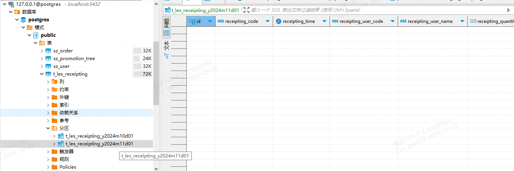

# 数据库脚本

业务表：见[t_les_receipting.sql](docs/t_les_receipting.sql)

分区存储过程：见[partition.sql](docs/partition.sql)，每次创建两个分区：当前分区和下一个分区

配置项：
```java
List<PartitionConfigBo> tableSettingList = JSON.parseArray("[{\"tableName\":\"t_les_receipting\",\"periodUnit\":\"month\",\"period\":1}]\n", PartitionConfigBo.class);
```

需要新增几条测试数据：http://{{ip}}:{{port}}/receipting/add
```json
{
    "receiptingCode": "receiptingCode",
    "receiptingSource": "receipting_source",
    "materialCode": "material_code",
    "materialName": "material_name",
    "materialVersion": "material_version",
    "materialUnit": "material_unit",
    "materialPiece": "1",
    "materialQuantity": "1",
    "demandCode": "demand_code",
    "demandNo": "1234",
    "demandQuantity": "1"
}
```


验证定时任务自动分区, 定时任务日志如下：
```sql
JDBC Connection [HikariProxyConnection@410580776 wrapping org.postgresql.jdbc.PgConnection@14168e1] will not be managed by Spring
==>  Preparing: call proc_create_partition(?, ?, ?)
==> Parameters: t_les_receipting(String), month(String), 1(Integer)
```

分区：t_les_receipting_y2024m10d01


分区：t_les_receipting_y2024m11d01

